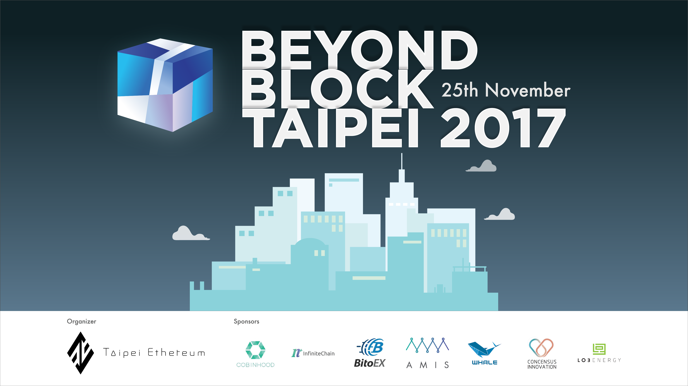
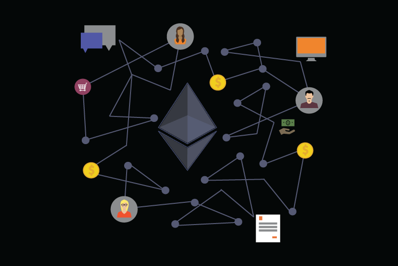
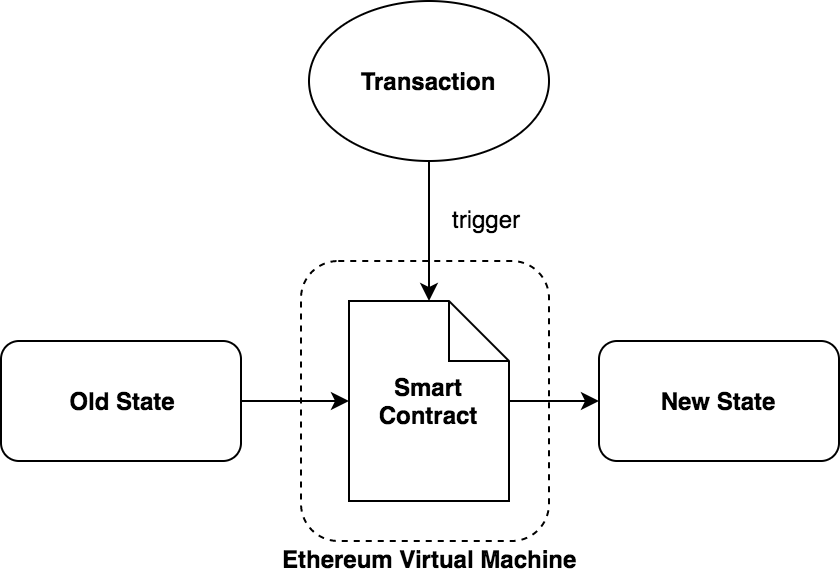

# Introduction to Smart Contract
[@juinc](https://github.com/juinc), [Taipei Ethereum Meetup](https://www.facebook.com/groups/443751072484739)

---
# Outline
- Who are We?
- What is Ethereum?
- How does Smart Contract Work?
- Application of Smart Contract: EtherDelta

---
# Who are We? (1)
- **Taipei Ethereum Meetup**
- Sharing knowledge of blockchain technology
- We have:
  - [Monthly Meetup](https://www.meetup.com/Taipei-Ethereum-Meetup/)
  - [Articles on Medium](https://medium.com/taipei-ethereum-meetup)
  - [Slack Channel]()
  - [Github](https://github.com/EtherTW/Taipei-Ethereum-Wiki)
  - Facebook [Group](https://www.facebook.com/groups/443751072484739/) & [Fanpage](https://www.facebook.com/eth.taipei/)
  - **Conference!!**

---
# Who are We? (2)
## [BeyondBlockTaipei 2017](https://ethertw.github.io/bbt2017/)

**Vitalik is HERE!**

---
# What is Ethereum (1)?
## A platform that runs decentralized applications

---
# What is Ethereum (2)?
## Difference between Bitcoin and Ethereum
- State Modeling (UTXO v.s. World State)
- Rewarding Mechanism (uncle blocks are introduced)
- Turing Complete Programmability (smart contract)

---
# How Does Smart Contract Work (1)?

---
# How Does Smart Contract Work (2)?
## Ethereum Virtual Machine
- A machine that performs instructions from compiled bytecode (smart contract) which is stored in world state
- Quasi-Turing-Complete Machine, will raise out-of-gas(oos) exception if the paid gas is insufficient

---
## Application of Smart Contract: EtherDelta (1)
### 2 types of contracts
- ERC20 Token Contract
- Exchange Contract

[reference: 去中心化交易所 — EtherDelta](https://medium.com/taipei-ethereum-meetup/dapp-%E6%87%89%E7%94%A8-%E5%8E%BB%E4%B8%AD%E5%BF%83%E5%8C%96%E4%BA%A4%E6%98%93%E6%89%80-etherdelta-8644928a34d7)

---
## Application of Smart Contract: EtherDelta (2)
### ERC20 Token
- ERC: Ethereum Request for Comments
- Spec of interface that token contract has to implement
- Interface including:
  - totalSupply
  - balanceOf
  - trasfer
  - transferFrom
  - approve
  - allowance

---
## Application of Smart Contract: EtherDelta (3)
### Exahange Contract

---
# Conclusion
### 1. Smart contract makes ethereum powerful
### 2. Join us!
- For developers
**Join our meetups and give us a talk**

- For non-developers
**Write some articles on trending or case study**
