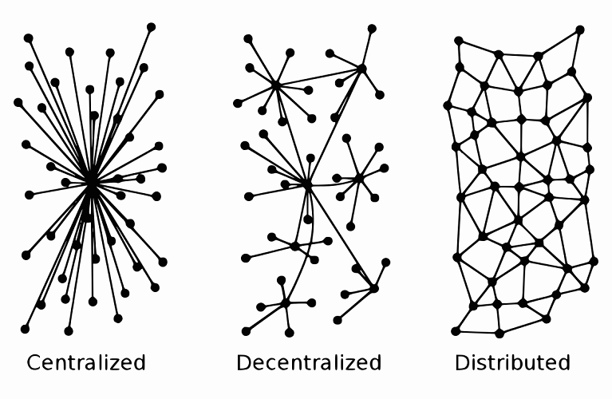
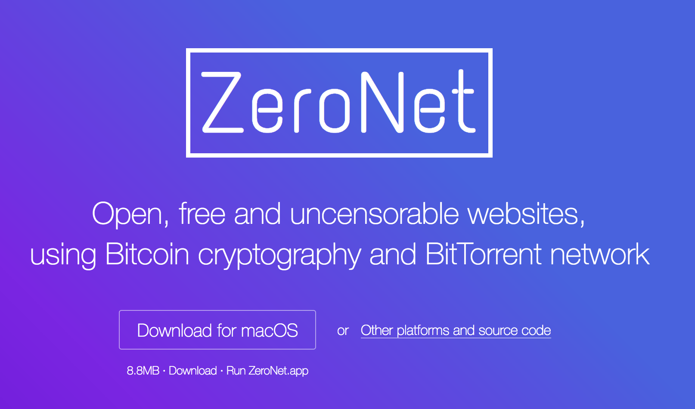
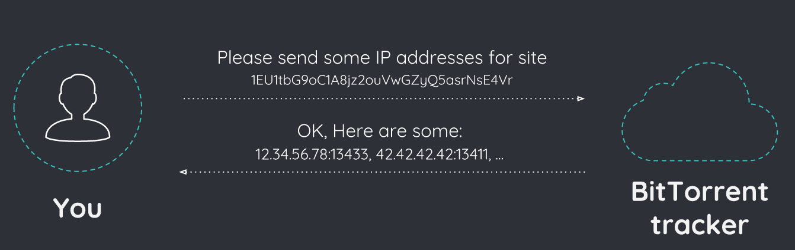
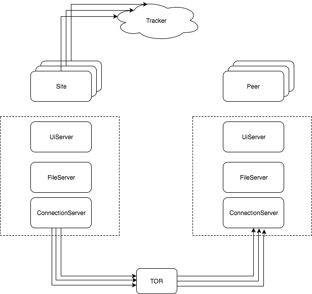

# The Power of Decentralized Internet: Take ZeroNet for Example

Juin Chiu 
github: [juinc](https://github.com/juinc)
facebook: [Juin Chiu](https://www.facebook.com/juin.chiu)

**AMAZE**

---
- ref: [ZeroNet official website](https://zeronet.io/en)
- ref: [ZeroNet github](https://github.com/HelloZeroNet/ZeroNet)

---

## What is Decentralized Internet?

- Oppisite to client / server-based architecture
- Documents / Data are distributed to visitors

---

## ZeroNet

- **No cencorship!** (Popular in Chinese community)
- Interesting applications are being developed. 
- (Decentralized facebook / youtube / spotify)

---

## How does ZeroNet work?

#### P2P 
- BitTorrent protocol

#### Encryption
- Elliptic Curve Cryptography (ECC, same as Bitcoin wallet)

#### Anonymity
- The Onion Router (TOR)

---

---

---

## I am currently interested in

- Ethereum
- blockchain
