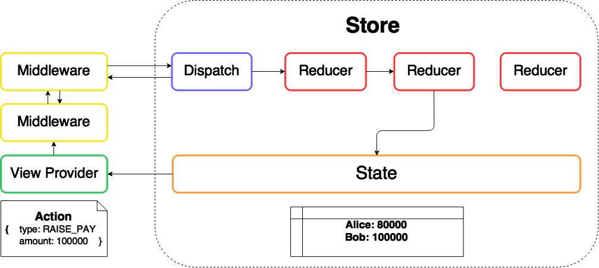

<div style="text-align:center">
  
  
  
  <h3>Exploring Functional Programming by Rebuilding Redux</h3>
  
</div>
<br/>
<div style="text-align:right">
  <h6>Juin Chiu <a href="https://github.com/davidjuin0519">@davidjuin0519</a></h6>
  <h6>Backend Engineer, iCook, Polydice. Inc</h6>
</div>

---
## The Goal
**Introduce basic functional programming concepts**
<br/>

## Why Functional Programming?

- Useful
- Elegant
- Abstract
- Mathematical

---
## What is Functional Programming?
**Functions are first-class citizen**

OO vs. FP:
Iteration&nbsp;&nbsp;&nbsp;&nbsp;&nbsp;&nbsp;&nbsp;&nbsp;&nbsp;&nbsp;&nbsp;&nbsp;&nbsp;&nbsp;&nbsp;&nbsp; vs.&nbsp;&nbsp;&nbsp;&nbsp; Recursion
Mutable&nbsp;&nbsp;&nbsp;&nbsp;&nbsp;&nbsp;&nbsp;&nbsp;&nbsp;&nbsp;&nbsp;&nbsp;&nbsp;&nbsp;&nbsp;&nbsp; vs.&nbsp;&nbsp;&nbsp;&nbsp; Immutable
Design Pattern&nbsp;&nbsp;&nbsp;&nbsp; vs.&nbsp;&nbsp;&nbsp;&nbsp; Composition

---
# What is Redux?
**Observable object tree**
with
&nbsp;&nbsp;&nbsp;&nbsp;**single interface for  state updating**
&nbsp;&nbsp;&nbsp;&nbsp;and
&nbsp;&nbsp;&nbsp;&nbsp;**flexible event handling mechanism**



---
## Implement a Redux Architecture in 3 steps

<span style="color: red">Step 1</span>: **Object with single interface for state updating**
<div style="text-align:center;">
  
</div>

<span style="color: red">Step 2</span>: **Observable object tree**
<div style="text-align:center">
  
</div>

<span style="color: red">Step 3</span>: **Flexible event handling mechanism**
<div style="text-align:center">
  
</div>

---
# Actually, I have built it ;)
# [Rubidux](https://github.com/davidjuin0519/rubidux)

---
<div style="text-align:center;">
  <h3>Step 1: Object with Single Interface for State Updating</h3>
  <br/>
  
  <br/>
  <h3>Reducer is a <span style="color: red">Lambda</span></h3>
</div>

---
# Lambda

- Named after **Lambda Calculus**
- Anonymous function
- First-class citizen
  - Can be stored in variables and data structures
  - Can be passed as a parameter to a subroutine
  - Can be returned as the result of a subroutine
- Foundation of higher-order functions
- **Reducer** is a lambda that takes `state` and `action` and then returns new `state`

---
# Example

```ruby
# Define a lambda and bind it to variable "add_one"
add_one = -> n { n + 1 }

# Pass "add_one" to higher-order function "map"
[1, 2, 3].map(&add_one) # => [2, 3, 4]

# Define a lambda that returns another lambda
time = -> t { -> n { n*t } }

# Pass "time" to higher-order function "map"
[1, 2, 3].map(&time.(3)) # => [3, 6, 9]
```

---
# Implementation

```ruby
reducer = -> (state, action) {
  state ||= { a: 0, b: 0 }
  case action[:type]
  when "a_plus_one"
    { a: state[:a] + 1, b: state[:b] }
  when "b_plus_one"
    { a: state[:a], b: state[:b] + 1 }
  else
    state
  end
}

# Usage

s = { a: 0, b: 0 }
a = { type: "a_plus_one" }

reducer.(s, a)
# => { a: 1, b: 0 }
```

---
<div style="text-align:center">
  <h3>Step 2-1: Object Tree</h3>
  <br />
  
  <br />
  <h3>Reducer tree is a <span style="color: red">Recursive Data Type</span></h3>
</div>

---
# Recursive Data Type

- A type for values that may contain other values of the same type
- Example: **Tree**
- Need to build a more complicated data structure of Reducer
- **Reducer** can be thought of as a recursive data type like **Tree**
<br />
<div style="text-align:center">
  
</div>

---
```ruby
module BinaryTree
  class Node
    attr_accessor :left, :right, :element
    def initialize(left, right, e)
      @left = left
      @right = right
      @element = e
    end
    def includes(e)
      if e > @element
        Node.new(@left, @right.includes(e), @element)
      elsif e < @element
        Node.new(@left.includes(e), @right, @element)
      else
        self
      end
    end
  end
  class EmptyNode
    def includes(e)
      Node.new(EmptyNode.new, EmptyNode.new, e)
    end
  end
end
```

---
# Example

```ruby
b = BinaryTree::EmptyNode.new.
                  includes(3).
                  includes(1).
                  includes(5).
                  includes(2).
                  includes(4).
                  includes(6)
# => #<BinaryTree::Node:0x007fc8ca848330...>

b.left
# => #<BinaryTree::Node:0x007fc8ca8487b8...>

b.right
# => #<BinaryTree::Node:0x007fc8ca8483d0...>
```

---
# Implementation

```ruby
module Reducer
  class Combined
    attr_accessor :func_map
    def initialize(**func_map)
      @func_map = func_map
    end
    def apply(state, action)
      func_map.map { |k, v| [k, v.apply(state[k], action)] }
              .to_h
    end
  end
  class Native
    attr_accessor :func
    def initialize(func)
      @func = func
    end
    def apply(state, action)
      func.(state, action)
    end
  end
end
```

---
```ruby
# Usage

ab = -> (state, action) {
  case action[:type]
  when "a_plus_one"
    { a: state[:a]+1, b: state[:b] }
  when "b_plus_one"
    { a: state[:a], b: state[:b]+1 }
  else
    state
  end
}

reducer = Reducer::Combined.new(
  foo: Reducer::Combined.new(ab: Reducer::Native.new(ab))
)
s = { foo: { ab: { a: 0, b: 0 } } }
a = { type: 'a_plus_one' }

reducer.apply(s, a)
# => {:foo=>{:ab=>{:a=>1, :b=>0}}}
```

---
# Simplified Version of Tree

1. Assume no other operations like `includes`
2. Use `Hash` to represent the tree structure
3. No distinction between `Node` and `EmptyNode`

```ruby
def merge(left, right, element)
  {
    left: left,
    right: right,
    element: element
  }
end

t1 = { left: nil, right: nil, element: 1 }
t2 = { left: nil, right: nil, element: 2 }

t = merge(t1, t2, 3)
# { :left    => { :left=>nil, :right=>nil, :element=>1 },
#   :right   => { :left=>nil, :right=>nil, :element=>2 },
#   :element => 3 }
```

---
# Simplified Implementation

```ruby
def combine
  -> **reducers {
    -> (state, action) {
      state ||= {}
      reducers.
        map { |key, reducer|
          [key, reducer.(state[key], action)] }.
        to_h
    }
  }
end

# Usage

reducer = combine.(foo:
  combine.(ad: ab)
)
s = { foo: { ab: { a: 0, b: 0 } } }
a = { type: 'a_plus_one' }

reducer.(s, a)
# => {:foo=>{:ab=>{:a=>1, :b=>0}}}
```
---
<div style="text-align:center">
  <h3>Step 2-2: Observable Object Tree</h3>
  <br />
  
  <br />
  <h3>1. Wrap the reducer tree in <span style="color: red">Store</span> to maintain the state</h3>
  <h3>2. Expose a function <span style="color: red">Dispatch</span> to update the state</h3>
</div>

---
<div style="text-align:center">
  <h3>Step 3: Flexible Event Handling Mechanism</h3>
  <br />
  
  <h3>Construct middlewares by <span style="color: red">Function Composition</span></h3>
</div>

---
# Function Composition

- `f(g(x))`
- Apply one function to the result of another function to produce a third function
- Control complexity by breaking larger function into smaller functions
- **Middleware** is built on function composition

---
# Example 1
```ruby
add_one  = -> n { n + 1 }
time_two = -> n { n * 2 }

[1, 2, 3].map { |n| time_two.(add_one.(n)) }
# => [4, 6, 8]
```
Question: Any more concise way to do this?

---
# Example 2
```ruby
add_one  = -> n { n + 1 }
time_two = -> n { n * 2 }

compose = -> f { -> g { -> n { g.(f.(n)) } } }

func = compose.(add_one).(time_two)

[1, 2, 3].map(&func)
# => [4, 6, 8]
```
Looks good, but what if we have more than two functions to compose?

---
# Example 3
```ruby
add_one  = -> f { -> n { f.(n+1) } }
time_two = -> f { -> n { f.(n*2) } }

compose  = -> funcs {
  init = -> n { n }
  funcs.reverse.reduce(init) { |acc, curr| curr.(acc) }
}

func = compose.([add_one, time_two])

[1, 2, 3].map(&func) # => [4, 6, 8]
```
We can compose arbitrary numbers of functions as long as they have the same structure.

---
# Implementation
```ruby
def create
  -> fn {
    -> **middleware_api {
      -> _next {
        -> action {
          fn.(_next, action, **middleware_api)
        }
      }
    }
  }
end

# Similar to example 3

# add_one  = -> f { -> n { f.(n+1) } }
# time_two = -> f { -> n { f.(n*2) } }
```

---
# Implementation
```ruby
def compose
  -> *funcs {
    if funcs.size == 1
      funcs[0]
    else
      -> init {
        funcs.
          reverse.
          reduce(init) { |composed, f| f.(composed) }
      }
    end
  }
end

# Similar to example 3

# compose  = -> funcs {
#   init = -> n { n }
#   funcs.reverse.reduce(init) { |acc, curr| curr.(acc) }
# }
```

---
# Implementation
```ruby
def apply
  -> *middlewares {
    -> (get_state, dispatch) {
      middleware_api = {
        get_state: get_state,
        dispatch: -> action { new_dispatch.(action) }
      }
      chain = middlewares.map { |middleware|
                middleware.(middleware_api) }
      new_dispatch = compose.(*chain).(dispatch)
    }
  }
end

# Similar to example 3

# func = compose.([add_one, time_two])
```

---
```ruby
# Usage

m1 = create.(
  -> (_next, action, **middleware_api) {
    puts "In middleware 1"
    _next.(action)
    puts "Out middleware 1"
  }
)

m2 = create.(
  -> (_next, action, **middleware_api) {
    puts "In middleware 2"
    _next.(action)
    puts "Out middleware 2"
  }
)

apply.(m1, m2).(STATE, DISPATCH).(ACTION)
# => "In middleware 1"
# => "In middleware 2"
# => "Out middleware 2"
# => "Out middleware 1"
```

---
# Summary

### What I have covered
Some concepts in Functional Programming such as:

- Lambda
- Recursive Data Type
- Function Composition

### What I havn't covered

- Immutable
- Lazy Evaluation
- Monad
- ...

### See [Rubidux](https://github.com/davidjuin0519/rubidux) for more details

---
# Thanks for your listening!