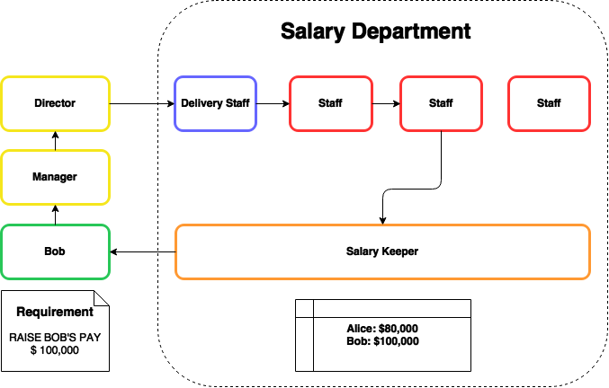
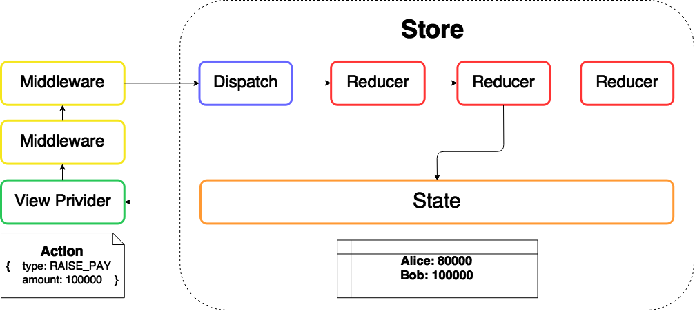

A Tour inside Redux
===
# 

###### Juin Chiu
###### Backend Engineer, iCook, Polydice. Inc

---
# About Me
#### Juin Chiu [@davidjuin0519](https://github.com/davidjuin0519)
**Language**:
- Ruby
- Javascript
- Scala

**Interested In**:
- Functional Programming
- Data Engineering
- Machine Learning

**Talks**:
**Exploring Functional Programming by Rebuilding Redux**
[@Ruby Conf Taiwan 2016](https://2016.rubyconf.tw)

---
# Asking for a Pay Raise
# 

---
# Redux
# 

---
# What are inside Redux?

#### 1. View Provider
#### 2. Action
#### 3. Store
#### 4. State
#### 5. Dispatch
#### 6. Reducer
#### 7. Middleware

---
# 1. View Provider

- Capable of calling `dispatch` and accessing `state`
- Sometimes need a bridge to attach to Redux

---
# The Bridge: React-Redux
```javascript
// BobsPay.js

class BobsPay extends Component {
 // ...
}

const mapStateToProps = state => 
  ({ pay: state.bob })

const mapDispatchToProps = dispatch => 
  ({
    raisePay: () => dispatch({ type: 'RAISE_PAY', 
                               amount: 100000 })
  })

export default connect(
  mapStateToProps,
  mapDispatchToProps
)(BobsPay)
```

---
# 2. Action

- Information of how to renew the **State**
- A plain object
- Must have the key `type`
- Other keys can be anything

### Example
```
{
  type: 'RAISE_PAY',
  amount: 100000
}
```

---
# 3. Store

- An enclosure for functions
  - `getState`: returns current **State**
  - `dispatch`: passes an **Action** to **Reducer**
  - `subscribe`: defines a callback after **State** is renewed
  - `replaceReducer`: replaces current **Reducer**
- Customizable with **Reducer** and **Middleware**

### Example
```javascript
const store = createStore(
  rootReducer,
  preloadedState,
  applyMiddleware(...middleware)
)
```

---
# Source Code

```javascript
// createStore.js

function createStore(reducer, preloadedState, enhancer) {
  // ...
  function getState() {
    // ...
  }

  function subscribe(listener) {
    // ...
  }

  function dispatch(action) {
    // ...
  }

  function replaceReducer(nextReducer) {
    // ...
  }
}
```

---
# 4. State

- A read-only object tree
- The only place to keep the data (Single Source of Truth)
- Can be renewed by **Reducer**

### Example
```javascript
{
  pay: {
    alice: 80000,
    bob: 100000,
  },
  willBePromoted: 'chris'
}
```

---
# 5. Dispatch

- A function
- Pass an **Action** to **Reducer**
- Can be passed to **Middleware**

### Example

```javascript
const action = { type: 'RAISE_PAY', amount: 100000 }

store.dispatch(action) 
// => { type: 'RAISE_PAY', amount: 100000 }
```

---
# Source Code

```javascript
// createStore.js

function dispatch(action) {
  // ...
  if (isDispatching) {
    throw new Error('Reducers may not dispatch actions.')
  }
  try {
    isDispatching = true
    currentState = currentReducer(currentState, action)
  } finally {
    isDispatching = false
  }

  var listeners = currentListeners = nextListeners
  for (var i = 0; i < listeners.length; i++) {
    var listener = listeners[i]
    listener()
  }

  return action
}
```

---
# 6. Reducer

- Pure Function
- Given **State** and **Action**, returns new **State**
- Can be combined to form a higher-order **Reducer**
- Only the root **Reducer** is passed into **Store**
- The **Reducer** tree maps to the **State** tree

---
# Example
```javascript
// reducer.js

const pay = (state = {}, action) =>
  switch(action.type) {
    case 'RAISE_PAY':
      return Object.assign({}, { bob: action.amount })
    default:
      return state
  }
  
const willBePromoted = (state = '', action) =>
  switch(action.type) {
    case 'BOB':
      return 'bob'
    default:
      return 'chris'
  }
```

---
# Example
```javascript
// reducer.js

const rootReducer = combineReducers({ pay, willBePromoted })

// This maps to the structure of state tree:
{
  pay: {
    alice: 80000,
    bob: 100000,
  },
  willBePromoted: 'chris'
}
```

---
# Source Code

```javascript
// combineReducer.js

function combineReducers(reducers) {
  var reducerKeys = Object.keys(reducers)
  var finalReducers = {}
  for (var i = 0; i < reducerKeys.length; i++) {
    var key = reducerKeys[i]

    if (typeof reducers[key] === 'function') {
      finalReducers[key] = reducers[key]
    }
  }
  var finalReducerKeys = Object.keys(finalReducers)
  // Next page
}
```

---
# Source Code

```javascript
// combineReducer.js

function combineReducers(reducers) {
  // ...
  return function combination(state = {}, action) {
    var hasChanged = false
    var nextState = {}
    for (var i = 0; i < finalReducerKeys.length; i++) {
      var key = finalReducerKeys[i]
      var reducer = finalReducers[key]
      var previousStateForKey = state[key]
      var nextStateForKey = reducer(previousStateForKey, action)
      nextState[key] = nextStateForKey
      hasChanged = hasChanged || nextStateForKey !== previousStateForKey
    }
    return hasChanged ? nextState : state
  }
}
```

---
# 7. Middleware

- Higher-order function
- function that wraps input function
- Currying 4 arguments

```javascript
const middleware =
  ({ dispatch, getState }) =>    // arg_1
    next =>                      // arg_2
      action => {                // arg_3
        // ...
        let val = next(action)
        // ...
        return val
      }
```

---
# Source Code

```javascript
// applyMiddleware.js

function applyMiddleware(...middlewares) {
  return (createStore) => 
    (reducer, preloadedState, enhancer) => {
      var store = createStore(reducer,
                              preloadedState,
                              enhancer)
      var dispatch = store.dispatch
      var chain = []
      var middlewareAPI = {
        getState: store.getState,
        dispatch: (action) => dispatch(action)
      }
      // Next page
    }
}
```

---
# Source Code

```javascript
// applyMiddleware.js

function applyMiddleware(...middlewares) {
  return (createStore) => 
    (reducer, preloadedState, enhancer) => {
      // ...
      chain = middlewares.map(middleware => 
                middleware(middlewareAPI)) 
                // arg_1 is given here
      dispatch = compose(...chain)(store.dispatch)

      return {
        ...store,
        dispatch
      }
    }
}
```

---
# Source Code

```javascript
// compose.js

export default function compose(...funcs) {
  if (funcs.length === 0) {
    return arg => arg
  }
  if (funcs.length === 1) {
    return funcs[0]
  }
  const last = funcs[funcs.length - 1]
  const rest = funcs.slice(0, -1)
  return (...args) => // args = store.dispatch
    rest.reduceRight(
      (composed, f) => f(composed), 
      // arg_2 is given here
      // The composed function becomes the argument 
      // of the current function
      last(...args)
    )
}
```

---
# Example

```javascript
const new_dispatch = compose([m1, m2, m3])(dispatch)
// => m1(m2(m3(dispatch)))

new_dispatch(act) // m1's arg_3 is given here
```

---
# Example

```javascript
// Inside m1

const m1 =
  ({ dispatch, getState }) =>
    next =>                   // next = m2(m3(dispatch))
      action => {             // action = act
        // ...
        let val = next(action)// m2(m3(dispatch))(act)
        // m2's arg_3 is given here
        // ...
        return val
      }
```

---
# Example

```javascript
// Inside m2

const m2 =
  ({ dispatch, getState }) =>
    next =>                    // next = m3(dispatch)
      action => {              // action = act
        // ...
        let val = next(action) // m3(dispatch)(act)
        // m3's arg_3 is given here
        // ...
        return val
      }
```

---
# Example

```javascript
// Inside m3

const m3 =
  ({ dispatch, getState }) =>
    next =>                    // next = dispatch
      action => {                
        // ...
        let val = next(action) // dispatch(action) 
        // ...
        return val
      }
```

---
# Summary

### What I have covered
- How **Redux** works
- How to implement most components of **Redux**

### What I havn't covered
- Functional Programming concepts used in **Redux**
- Implement **Redux** with other language, say Ruby

*Raed more in my [posts](https://github.com/davidjuin0519/til/issues?utf8=%E2%9C%93&q=label%3ARedux%20)

---