# How is Your Contract Executed in Ethereum?

[@juinc](https://github.com/juinc)

[Video Link](https://www.youtube.com/watch?v=MUoj_tQWK1c&feature=youtu.be)

---
# Outline

- Overview
- **Section 6: Transaction Execution**
- **Section 7: Contract Creation**
- **Section 8: Message Call**
- **Section 9: Execution Model**
- Conclusion

---
# Overview

- What is Blockchain?
  - **Destributed State Machine**
[(See more in my previous talk)](https://github.com/juinc/talks/blob/master/coscup/slides.md)

- What is the difference between **Bitcoin** and **Ethereum**?
  - **State Modeling (UTXO v.s. World State)**
  - **Rewarding Mechanism(uncle blocks are introduced)**
  - **Programmability (smart contract)**

- What is **Ethereum Virtual Machine (EVM)**?
  - **A machine that performs instructions from compiled bytecode (smart contract) which is stored in world state**

---
# EVM Overview

- **Stack-based Machine**
- **Memory Model: Word-addressed Byte Array, Volatile**
- **Storage Model: Word-addressed Word Array, Non-volatile**
- **Quasi-Turing-Complete Machine, will raise out-of-gas(oos) exception if the paid gas is insufficient**

---
# Section 6: Transaction Execution
## Overview
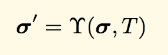

There are totally 5 phases of state during transaction execution:

- **Initial State => (Substrate gas limit x gas price and increment nonce)**
- **Checkpoint State => (Process message call or contract creation)**
- **Post-execution Provisional State => (Apply refunds and rewards)**
- **Pre-final State => (Delete destructed accounts)**
- **Final State**

---
# Section 6: Transaction Execution
## Validation
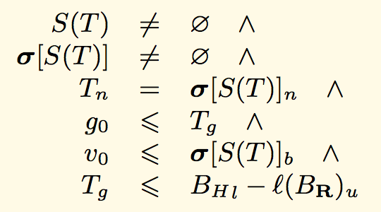

---
# Section 6: Transaction Execution
## Validation (Cont.)
### Where
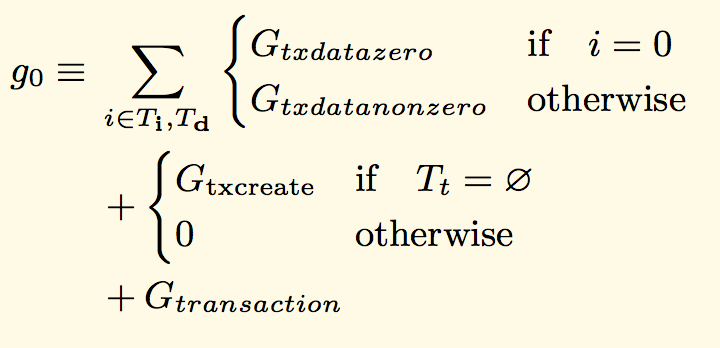
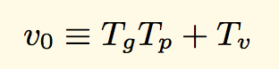

---
# Section 6: Transaction Execution
## (1) Substrate Gas Limit x Gas Price and Increment Nonce
### Initial State => Checkpoint State
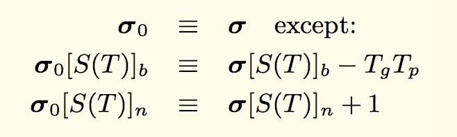

---
# Section 6: Transaction Execution
## (2) Process Message Call or Contract Creation
### Checkpoint State => Post-execution Provisional State
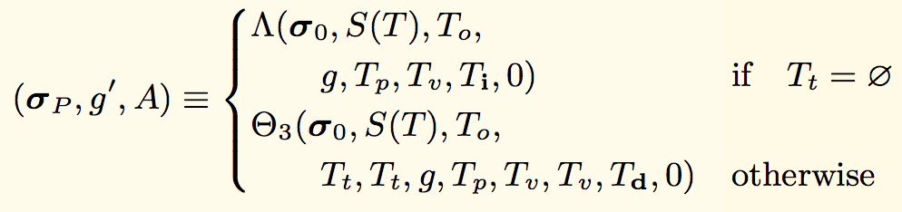
### Where
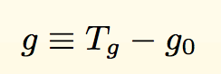

***These functions will be explained more in section 7 & 8**

---
# Section 6: Transaction Execution
## (3) Apply Refunds and Rewards
### Post-execution Provisional State => Pre-final State
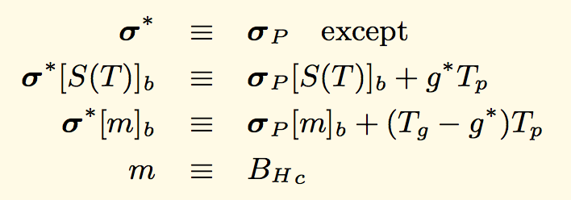
### Where
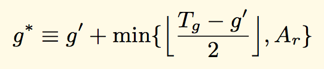

---
# Section 6: Transaction Execution
## (4) Delete Destructed Accounts
### Pre-final State => Final State
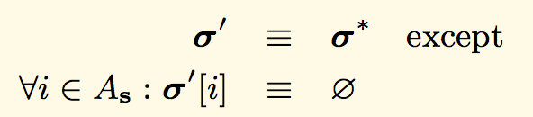

---
# Section 7: Contract Creation
## Overview
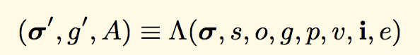
### Where
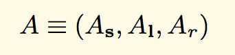

---
# Section 7: Contract Creation
## (1) Create a New Account
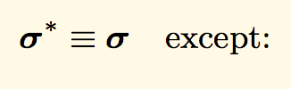
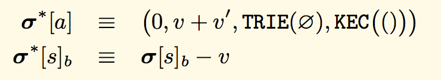

---
# Section 7: Contract Creation
## (1) Create a New Account (Cont.)
### Where
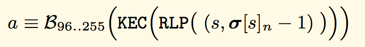
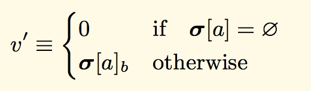

---
# Section 7: Contract Creation
## (2) Initialize
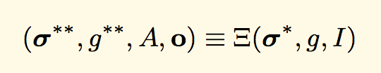

***The function will be expalined more in section 9**

---
# Section 7: Contract Creation
## (3) Determine Final State
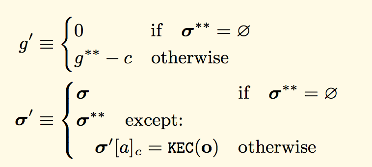
### Where
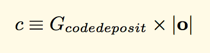

---
# Section 8: Message Call
## Overview
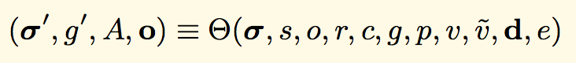

---
# Section 8: Message Call
## (1) Transfer Value
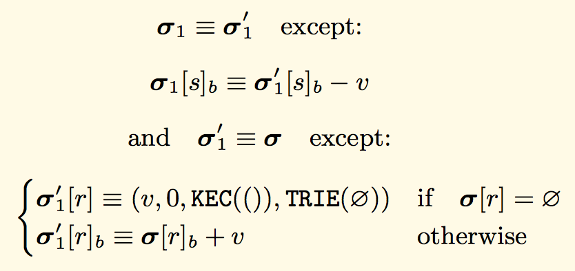

---
# Section 8: Message Call
## (2) Execute
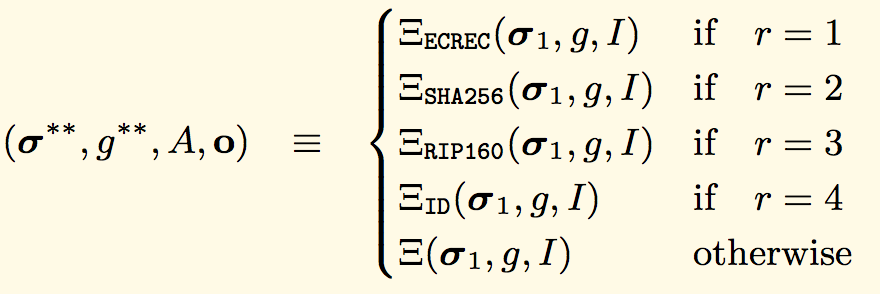
### Where r=1, r=2, r=3, r=4 are Precompiled Contracts

---
# Section 8: Message Call
## (3) Determine Final State
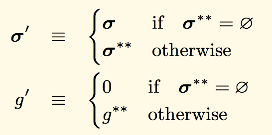

---
# Section 9: Execution Model
## Overview
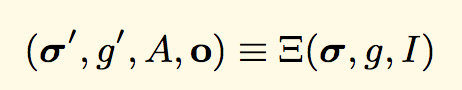

---
# Section 9: Execution Model
## (1) The Execution Function
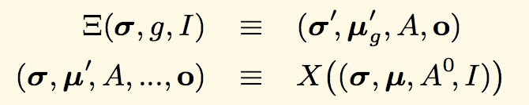
### Where
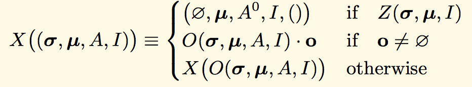
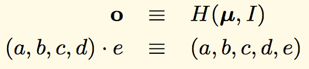

---
# Section 9: Execution Model
## (2) Conditions
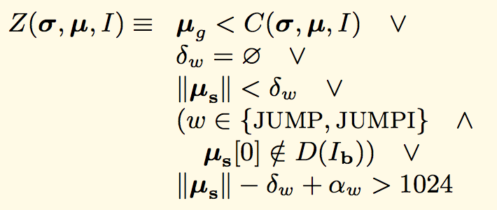
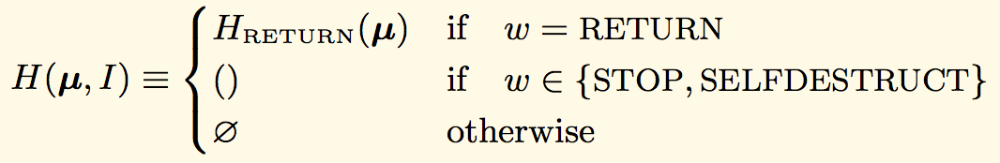

---
# Section 9: Execution Model
## (3) The Execution Cycle
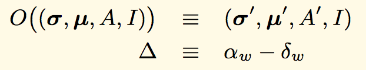

---
# Section 9: Execution Model
## (3) The Execution Cycle (Cont.)
### Where
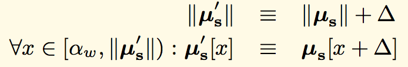
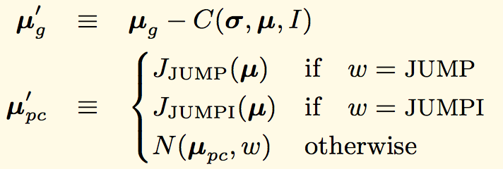

---
# Section 9: Execution Model
## (3) The Execution Cycle (Cont.)
### Where
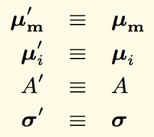

---
# Conclusion

- **Formulas are concise and elegant**
- **Focused on the whole picture thus many details are skipped**
- **Focused the EVM thus the consensus strategy are skipped**
