# How is the Consensus Reached in Ethereum?

[@juinc](https://github.com/juinc)

[Video Link](https://www.youtube.com/watch?v=wMWI8tVuubs)
---
# Outline

- Overview
- **Section 10: Blocktree to Blockchain**
- **Section 11: Block Finalisation**
- **Appendix J: ETHASH**

---
# Review
### Please refer to my previous talk:
- [Let's Make a Blockchain (Basic)](https://github.com/juinc/talks/blob/master/coscup/slides.md)
- [How is Your Contract Executed in Ethereum? (EVM)](https://github.com/juinc/talks/blob/master/taipei_ethereum_meepup/20170919_how_is_your_contract_executed_in_ethereum/slides.md)

---
# Overview

- **Consensus**: general agreement on the **World State**
- The consensus can be reached through different schemes:
  - **Proof of Work**
  - Proof of Stake
  - ...
- The process of applying or wrapping a block is called **finalization**

---
# Section 10: Blocktree to Blockchain
- The canonical blockchain is a path from root to leaf through the entire block tree
- Define **Total Difficulty**:
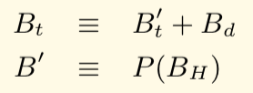
- Choose the path that has the most computation done upon it, or, **the most difficult path**

---
# Section 11: Block Finalization
### Peer (Non-miner) v.s. Miner
- Step 1: Validate (Determine) **Ommers**
- Step 2: Validate (Determine) **Transactions**
- Step 3: Apply **Rewards**
- Step 4: Validate (Determine) **State** and **Nonce**

---
# Recall: State Transition Function
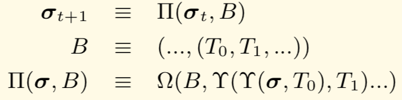
### where
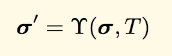
### (explained in [my last talk](https://github.com/juinc/talks/blob/master/taipei_ethereum_meepup/20170919_how_is_your_contract_executed_in_ethereum/slides.md#section-6-transaction-execution))

---
# Step 1: Validate (Determine) Ommers
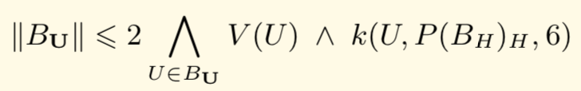
### where
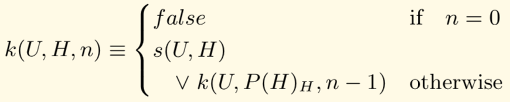
### and
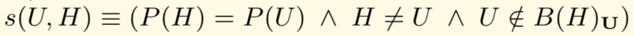

---
# Step 2: Validate (Determine) Transactions
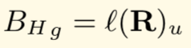

---
# Step 3: Apply Rewards
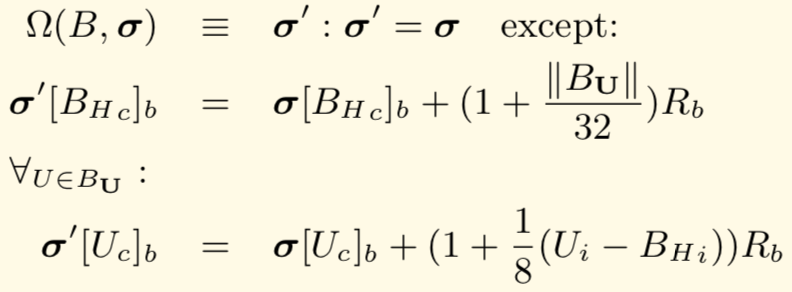
### where
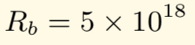

---
# Step 4: Validate (Determine) **State** and **Nonce**
## A. Validate
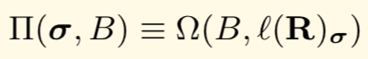
### where
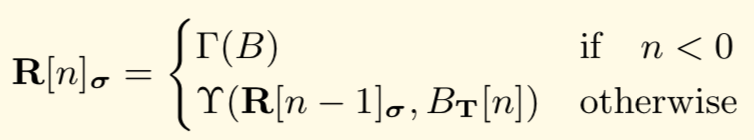

---
# Step 4: Validate (Determine) **State** and **Nonce**
## A. Validate (Cont.)
### and
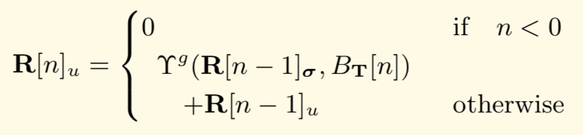
### and
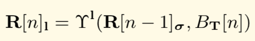

---
# Step 4: Validate (Determine) **State** and **Nonce**
## A. Validate (Cont.)
### and
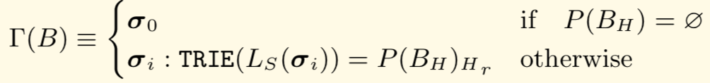
### and

---
# Step 4: Validate (Determine) **State** and **Nonce**
## B. Determine
### Block Transition Function
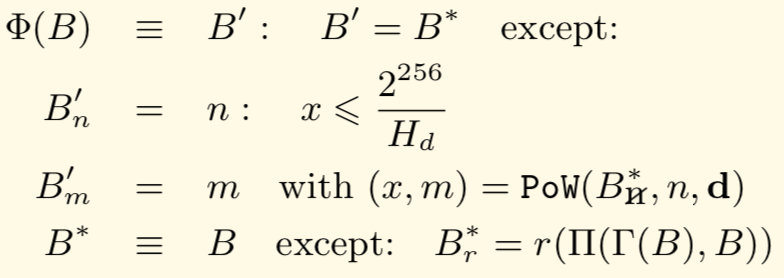

---
# Step 4: Validate (Determine) **State** and **Nonce**
## B. Determine (Cont.)
### Proof-of-work Function (Ethash)
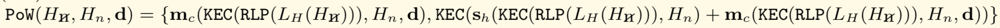

---
# Appendix J: Ethash
## Why Ethash?
- **ASIC-resistance**
- **Light Client Verifiability**

### ref: [Ethash](https://github.com/ethereum/wiki/wiki/Ethash)

---
# Appendix J: Ethash
1. Determine **Cache Size** and **Dataset (DAG) Size**
2. Determine **Seed Hash**
3. Determine **Cache**
   - Calculate **Initial Cache** from **Seed** and **Cache Size**
   - Calculate **Cache** from **RandMemoHash (RMH) Algorithm**
4. Determine **Dataset (DAG)** from **Cache**
5. Determine **Mix** from **Dataset (DAG)**, **Header**, and **Nonce**
6. Compare **Mix** to **Target**, repeat **5** until **Mix** is smaller than **Target** (PoW)

---
# Conclusion
- By looking into block finalization process, we can understand more on the whole picture of ethereum
- Implementation details might be different from what yellow paper describes
